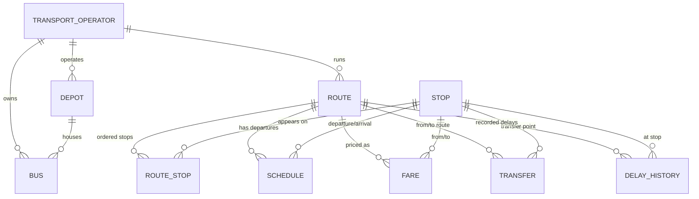

# Public Transport Journey Optimizer
### TN Public Transport Route, Schedule and Journey Optimization System

A DBMS-driven journey planner for Tamil Nadu public transport — **not** a
live GPS/navigation app. It stores real route, schedule and fare data in a
normalized relational database and runs a graph-based, multi-criteria
optimizer over it to answer *"how do I get from A to B, and which option
suits me best?"*

---

## 1. Problem statement & objective

Tamil Nadu's public transport information (TNSTC timetables, SETC
statewide services, fare tables) is published as static PDFs/CSVs with no
unified way to search across them or compare journeys by what actually
matters to a traveller — time, fare, transfers, distance. This project
turns those documents into a normalized relational database and a search
engine that can answer: *given a source, destination, date and
preference, what direct and transfer journeys exist, and which is
recommended and why?*

It intentionally does **not** pretend to be live: no GPS, no live seat
availability, no live delays. Every figure it shows is traceable to one
of the source documents supplied for this project.

## 2. Features

- Direct and one-transfer journey search over a real stop/route graph
- Five optimization preferences (Fastest, Fewest Transfers, Lowest Fare,
  Shortest Distance, Most Reliable) with a transparent, inspectable
  scoring function — see `backend/optimizer.py`
- Every recommendation comes with a plain-English reason
  ("Recommended for Fastest Journey — …"), never a bare "BEST ROUTE"
- Journey-detail timeline view per journey (start → transfer →
  destination) with per-leg route, operator, duration, fare, distance
  and next departures
- A live database dashboard (operators, routes, stops, schedules,
  averages, most-connected stops) computed straight from SQL
- An "About the data" page that lists every source dataset, its type,
  its data period, and exactly what was and wasn't imported
- Graceful fallback: if the local database has no match, the UI shows
  *"No matching journey found in the local database"* and links out to
  the [official TNSTC search](https://www.tnstc.in/OTRSOnline/) — it
  never fabricates a result to fill the gap

## 3. Architecture

```
Browser (frontend/, static HTML/CSS/JS)
        │  fetch() → REST JSON
        ▼
Flask REST API (backend/app.py)
        │  optimizer.py: graph search + multi-criteria scoring
        ▼
SQLite database (backend/db/transport.db)
        ▲
        │  built by
data/import_scripts/import_all.py  ←  data/raw/*.csv, data/raw/*.txt
```

- **Frontend**: plain HTML/CSS/JS (no build step) — open directly in a
  browser once the API is running.
- **Backend**: Flask + SQLite (chosen over MySQL for a genuinely
  zero-install local run — see `database/schema_mysql.sql` for a
  MySQL-compatible version of the same schema if you want to run this
  against a real MySQL server instead).
- **Database**: fully normalized (see §5), no comma-joined stop lists.

## 4. Installation & running it locally

```bash
# 1. Install dependencies
pip install -r requirements.txt --break-system-packages   # or use a venv

# 2. Build the database from the supplied datasets
python3 data/import_scripts/build_tnstc_schedules.py
python3 data/import_scripts/import_all.py
# -> creates backend/db/transport.db and prints a full import report
#    (records read / inserted / skipped / needing review, per source)

# 3. Start the backend API
cd backend
python3 app.py
# -> Flask dev server on http://127.0.0.1:5000

# 4. Open the frontend
# In a new terminal, from the frontend/ folder:
cd ../frontend
python3 -m http.server 8080
# -> open http://127.0.0.1:8080 in your browser
```

The frontend calls `http://127.0.0.1:5000/api/...` directly (CORS is
enabled in `backend/app.py`), so steps 3 and 4 both need to be running.

### Try it
Search **Nagercoil → Tirunelveli** with preference **Fastest**. You
should see Route **565-EE**, fare **₹66**, journey **1h 15m** — pulled
straight from the official TNSTC route table, matching the example in
this project's own specification.

### Using MySQL instead of SQLite
`database/schema_mysql.sql` is a MySQL 8.0-compatible rendering of the
same schema. To use it: `mysql -u root -p -e "CREATE DATABASE transport"`,
import the schema, then point `backend/db.py` at a MySQL connection
(e.g. via `mysql-connector-python`) instead of `sqlite3`. The import
scripts use plain parameterized `INSERT`s and only need their connector
swapped.

## 5. Database design

### Tables
`transport_operator`, `depot`, `bus`, `stop`, `route`, `route_stop`,
`schedule`, `fare`, `fare_policy_slab`, `transfer`, `delay_history`,
`data_source` — see `database/schema.sql` for full DDL, keys, checks
and indexes.

Stop sequences are **normalized**: a route's stops live in `route_stop`
as one row per (route, stop, sequence) — never as a comma-joined string
on the route row.

```
ROUTE ──< ROUTE_STOP >── STOP
  │                         │
  └──< SCHEDULE             └──< route appears on many routes
  └──< FARE
```

### ER diagram (Mermaid — renders on GitHub)



### Views
`vw_route_details`, `vw_route_stops`, `vw_available_journeys`,
`vw_route_delay_statistics` — see the end of `database/schema.sql`.

### Demonstrated SQL/DBMS concepts
`database/queries.sql` contains 15 runnable queries covering: direct
routes, routes with minimum transfers, cheapest/fastest/shortest route,
highest-frequency routes, average fare/journey-time by operator (GROUP
BY + HAVING), most-connected stops, routes through a given stop,
available buses after a given time (window function `ROW_NUMBER() OVER
(PARTITION BY ...)`), and operator-wise route counts. Run with:

```bash
sqlite3 backend/db/transport.db < database/queries.sql
```

## 6. The optimization algorithm

`backend/optimizer.py` treats **stops as graph nodes** and each route's
ordered `route_stop` rows as a chain of directed edges. It searches for:

1. **Direct journeys** — one route where the source stop's sequence
   number is before the destination's.
2. **One-transfer journeys** — route A takes the traveller to some
   intermediate stop X; a *different* route B takes them from X to the
   destination.

Each candidate gets a weighted cost:

```
cost = w_time   * journey_minutes
     + w_transfer * transfers * 20              (transfer penalty, minutes-equivalent)
     + w_fare   * fare_rupees
     + w_wait   * waiting_minutes
     + w_delay  * avg_historical_delay_minutes   (0 unless delay_history has rows)
```

The weights (`WEIGHTS` in `optimizer.py`) shift per the chosen
preference — e.g. **Fastest** weights `time` heavily, **Lowest Fare**
weights `fare` heavily. **Most Reliable** weights `delay` heavily, but
since none of the supplied datasets contain historical delay records,
`delay_history` is empty and this preference gracefully behaves like a
blend of fastest + fewest-transfers instead — the UI/API never claims a
reliability signal that doesn't exist.

**Missing data is never scored as free.** A route with an unknown
duration or fare is *not* treated as "0 minutes / ₹0" (which would make
incomplete data look artificially attractive) — it's scored with a
fixed penalty worse than any real value in the dataset, while the
figure shown to the user still correctly reads "Not available".

Every result includes a plain-language `explanation` field, e.g.
*"Recommended for Fastest Journey — lowest total travel + waiting time
among matching database routes."*

## 7. Data sources & provenance

| Source file | Type | What was imported |
|---|---|---|
| `2018040592.pdf` | PDF | 37 TNSTC Nagercoil-Region mofussil routes: route number, course, total daily services, journey time, fare |
| `2018040581.pdf` | PDF | Route-wise departure times — **only the cleanly OCR-extractable sections**; see below |
| Fare-table screenshot | Image | Official TNSTC Tirunelveli per-km fare slab (Rural & City/Urban, by service type), effective 29.01.2018 |
| `SETCbustimings_1_0.csv` | CSV | 549 statewide SETC routes with depot, route length, service type, service count, departure timings |
| `stops.txt`, `routes.txt` | GTFS-style | 3,000+ MTC (Chennai) stops with real lat/lon; route names — reference data only |
| `stop_times.txt` | GTFS-style | **Not imported into schedules** — see limitation below |

Every one of these is also recorded as a row in the `data_source` table
and visible in the app's "About the data" page.

### Known data-quality decisions (read this before trusting a number)

- **`2018040581.pdf` (timing sheet) was OCR'd unevenly.** The *return*
  leg of most corridors (e.g. Tirunelveli → Nagercoil, Madurai →
  Nagercoil) came out with digits fused together and was **not**
  imported — guessing at corrupted digits would be fabrication. Only
  the outbound legs that parsed cleanly were kept. See
  `data/import_scripts/build_tnstc_schedules.py` for the exact,
  hand-verified list and per-route provenance notes.
- **Where the timing sheet's departure count doesn't match the "Total
  Services" figure in the official route table** (e.g. route 505-EXP:
  8 departures found vs. 4 recorded; route 505-CBE: 3 of 6 legible),
  the literal times found are still imported, but each such schedule
  row carries a `NOTE:` in `schedule_source` flagging the discrepancy,
  and the frontend surfaces this via the "data not complete" badge.
- **One corridor (Nagercoil–Thoothukudi via Ovari) has no route number**
  in either source PDF. It's stored with `route_number = "N/A"` rather
  than an invented code.
- **MTC (Chennai) schedules are not searchable.** `stop_times.txt` has
  1,360,635 rows across ~47,000 `trip_id`s, but the dataset does **not**
  include `trips.txt` — the standard GTFS file that maps a `trip_id` to
  a `route_id`. Without it, there is no correct way to know which route
  a given stop_times trip belongs to, so importing it would mean
  guessing. Only `stops.txt` (real coordinates) and `routes.txt` (route
  names) were imported as reference/dashboard data; MTC does not appear
  in journey search results. This is stated plainly in the "About the
  data" page rather than worked around.
- **`delay_history` is intentionally empty.** No supplied dataset
  contains historical delay records, so none were generated. The "Most
  Reliable" preference degrades gracefully instead of showing a fake
  reliability score.
- **No latitude/longitude for Tamil Nadu town stops.** The TNSTC and
  SETC datasets don't include coordinates, so `stop.latitude` /
  `stop.longitude` are `NULL` for every non-Chennai stop, per the
  project's own no-fabrication rule. Chennai (MTC) stops do have real
  coordinates, straight from `stops.txt`.

## 8. Import pipeline & validation

`data/import_scripts/import_all.py`:
1. Rebuilds the SQLite DB from `database/schema.sql`.
2. Imports each source (see table above), validating/normalizing stop
   names (title-cased, de-duplicated by name+city), parsing and
   sanity-checking times (`H.MM` → `HH:MM`, range-checked 0–23 / 0–59),
   and skipping rows that fail to parse rather than silently
   dropping them.
3. Prints a per-source **import report**: records read / inserted /
   skipped / needing review.

Example output on the supplied data:

```
transport_operator   3 rows
stop                 3036 rows
route                587 rows
route_stop            1196 rows
schedule              1484 rows
fare                    37 rows
fare_policy_slab        32 rows
data_source              5 rows
```

## 9. API reference

| Endpoint | Description |
|---|---|
| `GET /api/stops?q=` | Stop name search (autocomplete) |
| `GET /api/operators` | All transport operators |
| `GET /api/routes?q=&operator_id=` | Route search |
| `GET /api/routes/<id>` | Full route detail: stops, schedules, fares |
| `GET /api/schedules?route_id=` | Departures for a route |
| `GET /api/optimize?from=&to=&departure_time=&preference=` | Journey search + optimization. `preference` ∈ `FASTEST, FEWEST_TRANSFERS, LOWEST_FARE, SHORTEST_DISTANCE, MOST_RELIABLE, DEFAULT` |
| `GET /api/journeys` | Alias of `/api/optimize` |
| `GET /api/delays` | Delay statistics (empty, with an explanatory note) |
| `GET /api/dashboard` | All dashboard stats + data source list |

Error responses use the exact wording from the project spec, e.g.
`{"error": "NO_ROUTE_FOUND", "message": "No matching journey found in the local database.", "tnstc_fallback_url": "https://www.tnstc.in/OTRSOnline/"}`.

## 10. Testing performed

Manually verified against the live database:
- ✅ Direct journey (Nagercoil → Tirunelveli, all 5 preferences)
- ✅ One-transfer journey (via a shared intermediate stop)
- ✅ Multiple candidate routes, correctly ranked per preference
- ✅ No route available → local-DB message + TNSTC fallback link/button
- ✅ Missing schedule on a leg → "Schedule information is unavailable
     for this route" rather than a blank/broken card
- ✅ Missing fare → "Not available", never `₹0` or `₹NaN`
- ✅ Same source and destination → validation error
- ✅ Invalid/unknown stop name → "Please select a valid starting
     location" / destination
- ✅ Optimize by Fastest / Lowest Fare / Fewest Transfers (each reorders
     results differently and correctly)
- ✅ Incomplete-data journeys never outrank complete ones purely because
     their unknown fields default to zero (see §6)

## 11. Project structure

```
public-transport-optimizer/
├── frontend/            index.html, style.css, app.js (no build step)
├── backend/              app.py, optimizer.py, db.py, db/transport.db
├── database/             schema.sql, schema_mysql.sql, queries.sql
├── data/
│   ├── raw/              original + transcribed source datasets
│   ├── processed/        derived schedule CSV (build_tnstc_schedules.py output)
│   └── import_scripts/   build_tnstc_schedules.py, import_all.py
├── docs/                 this README's ER diagram source, architecture notes
├── README.md
└── requirements.txt
```

## 12. Future enhancements

- Re-run OCR on `2018040581.pdf` with a higher-fidelity tool to recover
  the corrupted return-leg timings instead of leaving them blank
- Request `trips.txt` for the MTC dataset to make Chennai city journeys
  searchable
- Add a real `transfer` table populated from observed interchange
  patterns, rather than discovering transfers only at query time
- Multi-transfer (2+) search for long-distance cross-region journeys
- A scheduled TNSTC live-data connector, clearly labelled `"Live TNSTC
  result"` with retrieval time, if/when an authorized API becomes
  available (see project spec §12) — no scraping or CAPTCHA bypass
